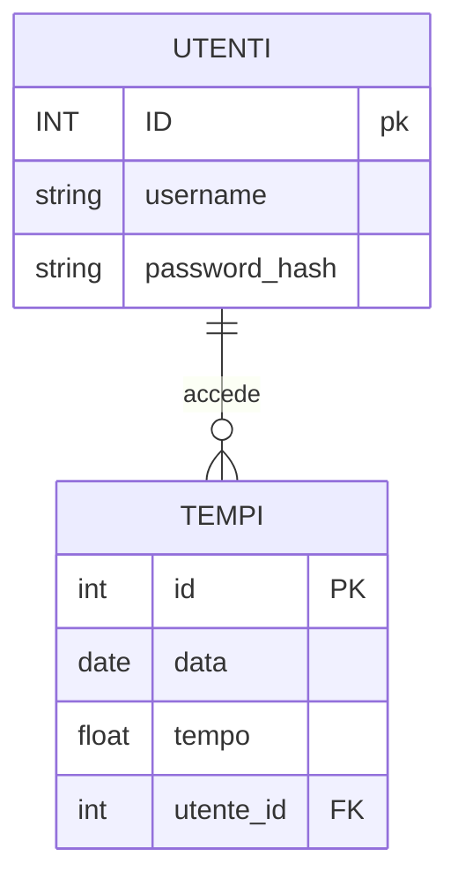

<div align="center">
  <h1>iKart Sites</h1>
</div>

iKart Sites è il sito ufficiale della pista indoor piu grande in europo "IKART" di riccione
<div align="center">
  
</div>

[](https://flask.palletsprojects.com/)
[](https://www.python.org/downloads/)

## Funzionalità principali

- **Login**: Puoi effettuare il login con le stesse credenziali inserite nel poprtale di accesso alla pista.
- **Visualizzazione tempi**: Dopo aver effettuato il login potrete vedere tutti i vostri tempi migliori effettuati alla pista ]
- **Go-kart** Visualizzazione di un modello 3d fedele a quelli che troverete nella nostra pista
- **Dashboard personalizzata**: Interfaccia utente intuitiva per accedere rapidamente alle principali funzionalità senza cambiare scheda.
- **Tempi aggiornati**: Integrazione con il file json per ottenere dati aggiornati su tutti i tempi effettuati alla pista 24h dopo averli effettuati
- **Design responsive**: Interfaccia utente moderna con luci dinamiche che funziona perfettamente su desktop e dispositivi mobili.

## Tecnologie utilizzate

- **Backend**: Flask, Python 3.8+, Json
- **Frontend**: HTML, CSS, JavaScript

## Dipendenze necessarie

- Python 3.8 o superiore
- Flask 2.2.3

## Configurazione delle variabili d'ambiente

Crea un file `.env` nella directory principale del progetto con i seguenti contenuti:
```
SECRET_KEY=x
```

## Struttura del progetto

```
PaginaRegistrazione/
├── app.py                  # File principale dell'applicazione Flask
├── tempi.json                  # File json con i tempi all interno
├── utenti.json                  # File json con le credenziali degli utenti all interno
├── static/               # css
│   └── style.css    # css  
└── templates/              # Template html
    ├── index.html            # Pagina principale
    ├── login.html            # Pagina per effettuare il login 
    ├── tempi.html        # Pagina visualizzazione tempi
```

- Gestione delle sessioni utente
- Profili utente personalizzabili


## Personalizzazione

- **Aspetto grafico**: Modifica i file in `static/css/` per personalizzare l'interfaccia.
- **Template**: Tutti i template HTML sono nella cartella `templates/` e possono essere personalizzati.

## Licenza

Questo progetto è rilasciato sotto licenza MIT.


## ER
